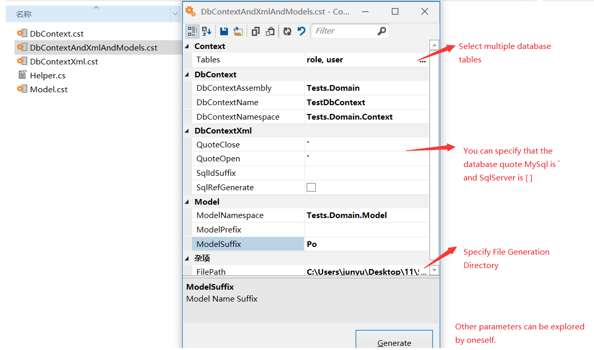

# Insql

[](https://ci.appveyor.com/project/rainrcn/insql/branch/master)

[](https://github.com/rainrcn/insql)
[](https://gitee.com/rainrcn/insql)

> 一个轻量级的.NET ORM 框架

## 1. 介绍

**Insql 是一个轻量级的.NET ORM 框架。对象映射基于 Dapper, Sql 配置灵感来自于 Mybatis。**

**🚀 追求简洁、优雅、性能与质量**

Insql 提倡以写原生 SQL 的方式来访问数据库，整体功能分为三块：

- 统一管理 SQL 语句，使用 XML 作为 SQL 语句的载体，将原本需要在程序中硬编码的 SQL 语句外置并统一管理。提供可以从多种来源加载 SQL 语句以及跨多种数据库匹配 SQL 的功能。
- 提供丰富的映射机制，使用Annotation方式，Fluent方式，以及XML Map方式来实现数据库表到对象属性的映射。
- 灵活的依赖注入与领域驱动模式的使用方式，可以更好的管理数据库连接以及数据库上下文的生命周期。

QQ 交流群：737771272 欢迎加入

## 2. 安装

| Package                                                              | Nuget Stable                                                                                                                            | Downloads                                                                                                                                |
| -------------------------------------------------------------------- | --------------------------------------------------------------------------------------------------------------------------------------- | ---------------------------------------------------------------------------------------------------------------------------------------- |
| [Insql](https://www.nuget.org/packages/Insql/)                       | [](https://www.nuget.org/packages/Insql/)                                  | [](https://www.nuget.org/packages/Insql/)                                  |
| [Insql.MySql](https://www.nuget.org/packages/Insql.MySql/)           | [](https://www.nuget.org/packages/Insql.MySql/)                | [](https://www.nuget.org/packages/Insql.MySql/)                |
| [Insql.Oracle](https://www.nuget.org/packages/Insql.Oracle/)         | [](https://www.nuget.org/packages/Insql.Oracle/)             | [](https://www.nuget.org/packages/Insql.Oracle/)             |
| [Insql.PostgreSql](https://www.nuget.org/packages/Insql.PostgreSql/) | [](https://www.nuget.org/packages/Insql.PostgreSql/) | [](https://www.nuget.org/packages/Insql.PostgreSql/) |
| [Insql.Sqlite](https://www.nuget.org/packages/Insql.Sqlite/)         | [](https://www.nuget.org/packages/Insql.Sqlite/)             | [](https://www.nuget.org/packages/Insql.Sqlite/)             |

## 3. 特性

- **支持 DotNet Core 2.0+ & DotNet Framework 4.6.1+**
- **支持依赖注入系统**
- **类似 MyBatis sql xml 配置语法**
- **多数据库支持**
- **高性能**
- **灵活扩展性**
- **使用简单直观**

## 4. 使用

### 4.1 使用 Insql

`Startup.cs`
```csharp
public void ConfigureServices(IServiceCollection services)
{
   services.AddInsql();  //会使用默认配置
}
```

### 4.2 示例代码

#### 4.2.1 基本用法示例

`AuthDbContext.cs`
```csharp
public class AuthDbContext : DbContext
{
    public AuthDbContext(DbContextOptions<AuthDbContext> options) : base(options)
    {
    }

    public UserInfo GetUser(int userId)
    {
        //第一个参数与select id 对应，第二个数据参数支持PlainObject和IDictionary<string,object>类型
        return this.Query<UserInfo>(nameof(GetUser), new { userId }).SingleOrDefault();
    }
}
```

`AuthDbContext.insql.xml`
```xml
<!--type与DbContext对应-->
<insql type="Insql.Tests.Domain.Contexts.AuthDbContext,Insql.Tests" >
  <select id="GetUser">
    select * from user_info where user_id = @userId
  </select>

  <select id="GetRoleList">
    select * from role_info order by sort_order
  </select>
</insql>
```
**_注意：在使用默认设置情况下 AuthDbContext.insql.xml 文件需要右键属性选择`嵌入式程序集文件方式`才会被搜索到_**

`Controllers` 或`Domain Services`中使用 DbContext

```csharp
[Route("api/[controller]/[action]")]
[ApiController]
public class AuthController : ControllerBase
{
    private readonly AuthDbContext dbContext;

    public UserService(AuthDbContext dbContext)
    {
        this.dbContext = dbContext;
    }

    [HttpGet]
    public UserInfo GetUser(string userId)
    {
        return this.dbContext.GetUser(userId);
    }

    [HttpGet]
    public UserInfo GetRoleList()
    {
        //可以这样dbContext直接调用
        return this.dbContext.Query<RoleInfo>("GetRoleList");
    }
}
```

`Startup.cs`

```csharp
public void ConfigureServices(IServiceCollection services)
{
    services.AddInsql();

    //将AuthDbContext添加到依赖注入容器中，默认生命周期为Scoped，一次WEB请求将创建一个DbContext对象，一个DbContext对象也将包含一条数据库连接
    services.AddDbContext<AuthDbContext>(options =>
    {
      //options.UseSqlServer(this.Configuration.GetConnectionString("sqlserver"));
      options.UseSqlite(this.Configuration.GetConnectionString("sqlite"));
    });
}
```

#### 4.2.2 公用上下文用法示例

`CommonDbContext.cs`
```csharp
public class CommonDbContext<T> : DbContext where T : class
{
    public CommonDbContext(CommonDbContextOptions<T> options) : base(options)
    {
    }

    protected override void OnConfiguring(DbContextOptionsBuilder optionsBuilder)
    {
        optionsBuilder.UseResolver<T>();  //解析SQL时会查找T类型与insql type对应的那些SQL语句

        optionsBuilder.UseSqlite("Data Source= ./insql.tests.db");  //指定使用的数据库链接
    }
}

public class CommonDbContextOptions<T> : DbContextOptions<CommonDbContext<T>> where T : class
{
    public CommonDbContextOptions(IServiceProvider serviceProvider)
    {
        this.ServiceProvider = serviceProvider;
    }
}
```

`UserInfo.insql.xml`
```xml
<!--type与CommonDbContext的T对应-->
<insql type="Insql.Tests.Models.UserInfo,Insql.Tests.Models" >
  <select id="GetUser">
    select * from user_info where user_id = @userId
  </select>
  <select id="GetUserList">
    select * from user_info where user_id in @userIdList
  </select>
</insql>
```
**_注意：在使用默认设置情况下 insql.xml 文件需要右键属性选择`嵌入式程序集文件方式`才会被搜索到_**


`Controllers` 或`Domain Services`中使用 DbContext

```csharp
[Route("api/[controller]/[action]")]
[ApiController]
public class AuthController : ControllerBase
{
    private readonly CommonDbContext<UserInfo> userDbContext;

    public UserService(CommonDbContext<UserInfo> userDbContext)
    {
        this.userDbContext = userDbContext;
    }

    [HttpGet]
    public UserInfo GetUser(string userId)
    {
        return this.userDbContext.Query<UserInfo>("GetUser",{ userId }).SingleOrDefault();
    }

    [HttpGet]
    public IEnumerable<UserInfo> GetUserList()
    {
        return this.userDbContext.Query<UserInfo>("GetUserList",{ userIdList = new string[] {'tome','jerry'} });
    }
}
```

`Startup.cs`

```csharp
public void ConfigureServices(IServiceCollection services)
{
    services.AddInsql();

    //将CommonDbContext添加到依赖注入容器
    services.AddSingleton(typeof(CommonDbContextOptions<>));
    services.AddScoped(typeof(CommonDbContext<>));
}
```

#### 4.2.3 事务使用

```csharp
public void InsertUserList(IEnumerable<UserInfo> list)
{
    try
    {
        this.dbContext.BeginTransaction();

        foreach (var item in list)
        {
            this.dbContext.InsertUserSelective(item);
        }

        this.dbContext.CommitTransaction();
    }
    catch
    {
        this.dbContext.RollbackTransaction();

        throw;
    }
}
```

使用`DoWithTransaction`扩展方法可以自动启动，并提交事务，遇到异常自动回滚。如果当前已经在事务中，则此扩展将不会再次启动和提交事务。

```csharp
public void InsertUserList(IEnumerable<UserInfo> list)
{
    this.dbContext.DoWithTransaction(() =>
    {
        foreach (var item in list)
        {
            this.dbContext.InsertUserSelective(item);
        }
    });
}
```

使用`DoWithOpen`扩展方法可以自动打开连接，关闭连接。如果当前连接已经被打开，则不会再次打开和关闭连接。

```csharp
public void InsertUserList(IEnumerable<UserInfo> list)
{
    this.dbContext.DoWithOpen(() =>
    {
        foreach (var item in list)
        {
            this.dbContext.InsertUserSelective(item);
        }
    });
}
```

#### 4.2.4 SELECT IN

```csharp
  var sqlParam = new { userIdList = new string[]{ "tom","jerry" } };
```

**1. 使用 Dapper 提供的列表参数转换功能**

```xml
<select id="GetUserList">
  select * from user_info
  where user_id in @userIdList
</select>
```
Dapper 执行时，会将原来的 SQL 语句转换为下面的SQL，再执行:

```sql
select * from user_info where user_id in (@userIdList1,@userIdList2)
```

**~~2. 使用 each(不推荐)~~**

```xml
<select id="GetUserList">
  select * from user_info
  where user_id in
  <each name="userIdList" open="(" separator="," close=")" prefix="@"  />
</select>
```

Insql Resolve 之后，会将原来的 SQL 语句转换为下面的SQL:

```sql
select * from user_info where user_id in (@userIdList1,@userIdList2)
```


#### 4.2.5 RESOLVE SQL

只使用InsqlResolver解析SQL语句

`Controller.cs`
```csharp
[Route("api/[controller]/[action]")]
[ApiController]
public class ResolveController : ControllerBase
{
    private readonly IInsqlResolver<UserInfo> userResolver;

    public UserService(IInsqlResolver<UserInfo> userResolver)
    {
        this.userResolver = userResolver;
    }

    [HttpGet]
    public string GetUserSql(string userId)
    {
        var resolveResult = sqlResolver.Resolve("GetUser", new { userId });
        //resolveResult = { Sql:"select....",Param:{"userId":"..."} }

        return resolveResult.Sql;
    }
}
```

## 5. 扩展用法

### 5.1 扩展CURD

`DbDialectExtensions.cs`
```csharp
public static partial class DbDialectExtensions
{
  public static string Quote(this IDbDialect dialect, string value)
  {
      return $"{dialect.OpenQuote}{value}{dialect.CloseQuote}";
  }
}
```

`DbContextExtensions.cs`
```csharp
public static partial class DbContextExtensions
{
  public static TEntity Select<TEntity>(this DbContext context, object keys) where TEntity : class
  {
      var map = context.Model.FindMap(typeof(TEntity));

      if (map == null)
      {
        throw new Exception($"insql entity type : {typeof(TEntity)} is not mapping!");
      }

      var wcols = map.Properties.Where(p => !p.IsIgnored && p.IsKey).ToList();

      var sql = $"SELECT * FROM {context.Dialect.Quote(map.Table)} " +
          $"WHERE {string.Join(" AND ", wcols.Select(col => $"{context.Dialect.Quote(col.ColumnName)} = {context.Dialect.ParameterPrefix}{col.PropertyInfo.Name}"))}";

      return context.Session.Connection.Query(sql, keys, context.Session.Transaction, true, context.Session.CommandTimeout).SingleOrDefault();
  }

  public static int Insert<TEntity>(this DbContext context, TEntity entity) where TEntity : class
  {
      var map = context.Model.FindMap(typeof(TEntity));

      if (map == null)
      {
        throw new Exception($"insql entity type : {typeof(TEntity)} is not mapping!");
      }

      var cols = map.Properties.Where(p => !(p.IsIgnored || p.IsIdentity || p.IsReadonly)).ToList();

      var sql = $"INSERT INTO {context.Dialect.Quote(map.Table)} " +
          $"({string.Join(",", cols.Select(col => context.Dialect.Quote(col.ColumnName)))}) " +
          $"VALUES ({string.Join(",", cols.Select(col => $"{context.Dialect.ParameterPrefix}{col.PropertyInfo.Name}"))})";

      return context.Session.Connection.Execute(sql, entity, context.Session.Transaction, context.Session.CommandTimeout);
  }

  public static int Update<TEntity>(this DbContext context, TEntity entity) where TEntity : class
  {
      var map = context.Model.FindMap(typeof(TEntity));

      if (map == null)
      {
        throw new Exception($"insql entity type : {typeof(TEntity)} is not mapping!");
      }

      var ucols = map.Properties.Where(p => !(p.IsIgnored || p.IsIdentity || p.IsKey || p.IsReadonly)).ToList();
      var wcols = map.Properties.Where(p => !p.IsIgnored && p.IsKey).ToList();

      var sql = $"UPDATE {context.Dialect.Quote(map.Table)} SET " +
          $"{string.Join(",", ucols.Select(col => $"{context.Dialect.Quote(col.ColumnName)} = {context.Dialect.ParameterPrefix}{col.PropertyInfo.Name}"))}" +
          $"WHERE {string.Join(" AND ", wcols.Select(col => $"{context.Dialect.Quote(col.ColumnName)} = {context.Dialect.ParameterPrefix}{col.PropertyInfo.Name}"))}";

      return context.Session.Connection.Execute(sql, entity, context.Session.Transaction, context.Session.CommandTimeout);
  }

  public static int Delete<TEntity>(this DbContext context, TEntity entity) where TEntity : class
  {
      return context.Delete<TEntity>((object)entity);
  }

  public static int Delete<TEntity>(this DbContext context, object entity) where TEntity : class
  {
      var map = context.Model.FindMap(typeof(TEntity));

      if (map == null)
      {
        throw new Exception($"insql entity type : {typeof(TEntity)} is not mapping!");
      }

      var wcols = map.Properties.Where(p => !p.IsIgnored && p.IsKey).ToList();

      var sql = $"DELETE FROM {context.Dialect.Quote(map.Table)} " +
          $"WHERE {string.Join(" AND ", wcols.Select(col => $"{context.Dialect.Quote(col.ColumnName)} = {context.Dialect.ParameterPrefix}{col.PropertyInfo.Name}"))}";

      return context.Session.Connection.Execute(sql, entity, context.Session.Transaction, context.Session.CommandTimeout);
  }
}
```
**_注意：以上扩展方法不包含在库中，需要自行扩展并且需要实体映射数据支持_**

## 6. 对象映射

支持Map,Annotation,Fluent三种方式对象属性映射

### 6.1 Xml

`UserInfo.insql.xml`
```xml
<insql type="Insql.Tests.Models.UserInfo,Insql.Tests.Models" >
  <map table="user_info" type="Insql.Tests.Models.UserInfo,Insql.Tests.Models">
   <key name="user_id" property="UserId" />
   <column name="user_name" property="UserName" />
   <column name="user_gender" property="UserGender" />
  </map>
</insql>
```
设置XML MAP映射，此方式会默认启用

```csharp
public void ConfigureServices(IServiceCollection services)
{
    services.AddInsql(builder=>
    {
        builder.AddProvider(providerBuilder =>
        {
            //可以设置需要扫描的程序集，如果不设置则默认扫描当前AppDomain中的所有程序集
            //此设置同时作用于sql和map配置节
            providerBuilder.AddEmbeddedXml(options =>
            {
                options.Assemblies = AppDomain.CurrentDomain.GetAssemblies();
            });
        });

        builder.AddMapper(options =>
        {
            //options.ExcludeXmlMaps(); //可以排除XmlMap的映射
        });
    });
}
```

### 6.2 Fluent
`FluentModelInfoBuilder.cs`
```csharp
public class FluentModelInfoBuilder : InsqlEntityBuilder<FluentModelInfo>
{
    public FluentModelInfoBuilder()
    {
        this.Table("fluent_model_info");

        this.Property(o => o.Id).Column("id").Key().Identity();
        this.Property(o => o.Name).Column("name");
        this.Property(o => o.Size).Column("Size");
        this.Property(o => o.Extra).Ignore();
        this.Property(o => o.ReadOnlyExtra).Readonly();
    }
}
```
设置Fluent方式映射，不会默认启用

```csharp
public void ConfigureServices(IServiceCollection services)
{
    services.AddInsql(builder=>
    {
        builder.AddMapper(options =>
        {
            //启用Fluent方式的映射扫描，如果不设置参数则默认扫描当前AppDomain中的所有程序集
            //会扫描并映射所有继承 InsqlEntityBuilder<T> 的实体类型
            options.IncludeFluentMaps();  
            //options.IncludeFluentMaps(assemblies..);
        });
    });
}
```

### 6.3 Annotation

`AnnotationModelInfo.cs`
```csharp
[Table("annotation_model_info")]
public class AnnotationModelInfo
{
    [Key]
    [DatabaseGenerated(DatabaseGeneratedOption.Identity)]
    [Column("id")]
    public int Id { get; set; }

    [Column("name")]
    public string Name { get; set; }

    public int Size { get; set; }

    [NotMapped]
    public string Extra { get; set; }

    [Editable(AllowEdit=false)]
    public string ReadOnlyExtra { get; set; }
}
```
设置Annotation方式映射，不会默认启用

```csharp
public void ConfigureServices(IServiceCollection services)
{
    services.AddInsql(builder=>
    {
        builder.AddMapper(options =>
        {
            //启用Annotation方式的映射扫描，如果不设置参数则默认扫描当前AppDomain中的所有程序集
            //会扫描并映射所有带 [Table] 特性的实体类型
            options.IncludeAnnotationMaps();  
            //options.IncludeAnnotationMaps(assemblies..);
        });
    });
}
```

### 6.4 多种映射优先级
建议只启用其中一种方式的实体映射功能。但是如果同时启用多种映射方式，那么对于同一个实体类型，XmlMap -> FluentMap -> AnnotationMap前者会覆盖后者。

## 7. 配置语法

**xxx.insql.xml** 中的配置语法类似于 Mybatis 的配置语法，目前支持以下配置节：

- **map**
  - **key**
  - **column**
- **sql**
  - **include**
  - **bind**
  - **if**
  - **where**
  - **set**
  - **trim**
  - **~~each(不推荐)~~**
  - **IfNotNull(新增)**
  - **IfNotEmpty(新增)**
- **select** = **sql**
- **insert** = **sql**
- **update** = **sql**
- **delete** = **sql**

### 7.1 map

`map`配置节用于数据库表字段到对象属性的映射，这样只要通过`DbContext.Query<UserInfo>`查询的都将使用此映射

```xml
<map table="user_info" type="Insql.Tests.Models.UserInfo,Insql.Tests.Models">
  <key name="user_id" property="UserId" />
  <column name="user_name" property="UserName" />
  <column name="user_gender" property="UserGender" />
</map>
```

| 子元素名 | 属性名      | 属性说明   | 说明                  |
| -------- | ----------- | ---------- | --------------------- |
| `key`    |             |            | 表示主键列            |
|          | `name*`     | 表列名     |                       |
|          | `property*` | 对象属性名 |                       |
|          | `identity`  | 标识列     | identity="True,False" |
| `column` |             |            | 表示普通列            |
|          | `name*`     | 表列名     |                       |
|          | `property*` | 对象属性名 |                       |
|          | `readonly`  | 只读属性   | readonly="True,False" |

### 7.2 sql

`sql`配置节用于配置数据库执行语句。`select`,`insert`,`update`,`delete`与`sql`具有相同功能，只是`sql`配置节的别名。

```xml
<sql id="userColumns">
  user_id as UserId,user_name as UserName,user_gender as UserGender
</sql>

<select id="GetUser">
  select
  <include refid="userColumns" />
  from user_info
  where user_id = @userId
</select>
```

| 子元素名           | 属性名            | 属性说明                                                                | 说明                                                                                                                                |
| ------------------ | ----------------- | ----------------------------------------------------------------------- | ----------------------------------------------------------------------------------------------------------------------------------- |
| `include`          |                   |                                                                         | 导入其他`sql`配置节                                                                                                                 |
|                    | `refid*`          | 要导入的配置节 `id`                                                     |                                                                                                                                     |
| `bind`             |                   |                                                                         | 创建新查询参数到当前参数列表，例如 like 模糊查询场景                                                                                |
|                    | `name*`           | 创建的新参数名称                                                        |                                                                                                                                     |
|                    | `value*`          | 动态脚本表达式，例如: '%'+userName+'%'                                  |                                                                                                                                     |
|                    | `valueType`       | 指定`value`返回的类型，格式为 System.TypeCode 枚举,数值类型最好明确指定 |                                                                                                                                     |
| `if`               |                   |                                                                         | 判断动态表达式，满足则输出内部内容                                                                                                  |
|                    | `test*`           | 动态表达式，需要返回 bool 类型，例如: userName != null                  |                                                                                                                                     |
| `where`            |                   |                                                                         | 在当前位置添加`where` sql 段，具体是否输出`where`决定于其内部子元素是否有有效的内容输出，并且会覆盖开头的 `and`,`or`                |
| `set`              |                   |                                                                         | 在当前位置添加`set` sql 段，主要用于`update`配置节中，具体是否输出`set`决定于其内部子元素是否有有效的内容输出，并且会覆盖结尾的 `,` |
| `trim`             |                   |                                                                         | 修剪包裹的元素输出，可以指定的前缀字符和后缀字符来包裹子元素                                                                        |
|                    | `prefix`          | 包裹的前缀字符                                                          |                                                                                                                                     |
|                    | `suffix`          | 包裹的后缀字符                                                          |                                                                                                                                     |
|                    | `prefixOverrides` | 会覆盖内部输出开头指定字符                                              |                                                                                                                                     |
|                    | `suffixOverrides` | 会覆盖内部输出结尾指定字符                                              |                                                                                                                                     |
| ~~`each(不推荐)`~~ |                   |                                                                         | 循环数组类型的查询参数每个值                                                                                                        |
|                    | `name*`           | 循环的数组参数名称                                                      |                                                                                                                                     |
|                    | `separator`       | 每个值之间的分隔符                                                      |                                                                                                                                     |
|                    | `open`            | 包裹的左侧字符                                                          |                                                                                                                                     |
|                    | `close`           | 包裹的右侧字符                                                          |                                                                                                                                     |
|                    | `prefix`          | 每个值名称前缀                                                          |                                                                                                                                     |
|                    | `suffix`          | 每个值名称后缀                                                          |                                                                                                                                     |
| `IfNotNull(新增)`  |                   |                                                                         | 如果查询参数值存在并且不为null                                                                                                      |
|                    | `name*`           | 查询参数名称                                                            |
| `IfNotEmpty(新增)` |                   |                                                                         | 如果查询参数字符串值存在并且不为空字符串                                                                                            |
|                    | `name*`           | 查询参数名称                                                            |


`include`,`where`,`if`,`bind`

```xml
<select id="GetUserList">
    <include refid="selectUserColumns" />
    <where>
        <if test="userName != null">
          <bind name="likeUserName" value="'%' + userName + '%'" />
          user_name like @likeUserName
        </if>
        and user_gender = @userGender
    </where>
    order by  user_id
  </select>
```

`set`

```xml
<update id="UpdateUserSelective">
  update user_info
  <set>
    <if test="UserName != null">
      user_name=@UserName,
    </if>
    user_gender=@UserGender
  </set>
  where user_id = @UserId
</update>
```

`trim`

```xml
<insert id="InsertUserSelective">
    insert into user
    <trim prefix="(" suffix=")" suffixOverrides=",">
      user_id,
      <if test="UserName != null">
        user_name,
      </if>
      <if test="UserGender != null">
        user_gender,
      </if>
      create_time,
      <if test="LastLoginTime != null">
        last_login_time,
      </if>
    </trim>
    <trim prefix="values (" suffix=")" suffixOverrides=",">
      @UserId,
      <if test="UserName != null">
        @UserName,
      </if>
      <if test="UserGender != null">
        @UserGender,
      </if>
      @CreateTime,
      <if test="LastLoginTime != null">
        @LastLoginTime,
      </if>
    </trim>
  </insert>
```

~~`each(不推荐)`~~

```xml
<select id="EachIn">
  select * from user_info
  where user_id in
  <each name="userIdList" open="(" separator="," close=")" prefix="@"  />
</select>
```

Insql Resolve:

```sql
select * from user_info where user_id in (@userIdList1,@userIdList2)
```
**_注意：解析之后会删除原先的`userIdList`参数，并增加`userIdList1`,`userIdList2`参数_**

## 8. 动态脚本

动态脚本语法为 JAVASCRIPT。支持 ECMAScript 6 的常用对象属性。

```xml
<if test="userGender !=null and userGender == 'W' ">
  and user_gender = @userGender
</if>
```

`userGender !=null and userGender == 'W'`部分为动态脚本。

### 8.1 操作符转换

因为`&`,`<`这些在 XML 中有特殊意义，所以支持将在动态脚本中这些符号转换。目前支持下列符号转换：

| 转换前 | 转换后 |
| ------ | ------ |
| `and`  | `&&`   |
| `or`   | `\|\|` |
| `gt`   | `>`    |
| `gte`  | `>=`   |
| `lt`   | `<`    |
| `lte`  | `<=`   |
| `eq`   | `==`   |
| `neq`  | `!=`   |

_操作符转换功能可以被禁用，也可以排除其中部分操作符的转换_

**_注意：请避免与上述操作符名称相同的查询参数，如果无法避免，可以设置排除有冲突的操作符。之后用 xml 转移符号实现操作符_**

### 8.2 枚举转换为字符串

`userGender == 'W'` `userGender`属性为枚举类型，在动态脚本中会默认转换为字符换格式。可以禁用此转换功能，禁用后枚举会被转换为`number`类型。

### 8.3 时间类型转换

如果查询参数中包含时间类型`DateTime`将被转 JS 中的`Date`类型，因为 Date 最小时间为 1970.1.1，所以如果查询对象中有未赋值的 DateTime(0001.1.1)，或者小于 1970 这个时间的 DateTime，将被默认转换为 1970.1.1，转换只是发生在动态脚本运行时，并不会影响查询参数的原始值。如果参数对象中有未赋值的`DateTime?`类型，那么它本身会是 null，并不会被转换。

### 8.4 设置动态脚本

```csharp
public void ConfigureServices(IServiceCollection services)
{
    services.AddInsql(builder =>
    {
        builder.AddResolver(configure =>
        {
            configure.AddScripter(options =>
            {
                options.IsConvertEnum = false;  //不转换枚举到字符串
                options.IsConvertDateTimeMin = false; //不转换最小时间
                options.IsConvertOperator = false;  //不转换操作符
                options.ExcludeOperators = new string[] { "eq","neq" }; //排除操作符转换
            });
        });
    });
}
```

## 9. 多数据库匹配

```xml
<!--默认，例子用Sqlite数据库-->
<insert id="InsertUser">
  insert into user_info (user_name,user_gender) values (@UserName,@UserGender);
  select last_insert_rowid() from user_info;
</insert>
<!--MySql-->
<insert id="InsertUser.MySql">
  insert into user_info (user_name,user_gender) values (@UserName,@UserGender);
  select LAST_INSERT_ID();
</insert>
<!--SqlServer-->
<insert id="InsertUser.SqlServer">
  insert into user_info (user_name,user_gender) values (@UserName,@UserGender);
  select SCOPE_IDENTITY();
</insert>
```

### 9.1 匹配规则

```csharp
public void ConfigureServices(IServiceCollection services)
{
    services.AddDbContext<AuthDbContext>(options =>
    {
      //匹配哪个sql id，决定于使用何种数据库
      options.UseSqlServer(this.Configuration.GetConnectionString("sqlserver"));
      //options.UseSqlite(this.Configuration.GetConnectionString("sqlite"));
    });
}
```

**_如果当前使用的是 SqlServer，则会优先匹配后缀带`.SqlServer`的语句。如果未找到则匹配默认不带后缀的语句。_**

**_目前支持匹配的数据库后缀：`SqlServer` `Sqlite` `MySql` `Oracle` `PostgreSql`_**

### 9.2 扩展数据库支持

对于其他数据库的支持是没有限制的，只要需支持的数据库有支持.NET 的客户端库，支持起来非常容易。需要实现`IDbDialect` `IDbSessionFactory`接口。

## 10. 多配置来源

### 10.1 嵌入程序集文件方式来源


**设置来源参数：**

```csharp
public void ConfigureServices(IServiceCollection services)
{
    services.AddInsql(builder =>
    {
        builder.AddProvider(providerBuilder =>
        {
            providerBuilder.AddEmbeddedXml(options =>
            {
                options.Enabled = false;    //可以禁用此来源功能，默认为启用状态
                //options.Matches = "**/*.insql.xml"; //glob文件过滤表达式，此为默认值
                //options.Assemblies = AppDomain.CurrentDomain.GetAssemblies(); //指定扫描的程序集，默认为当前AppDomain中的程序集。
            });
        });
    });
}
```

### 10.2 外部文件目录方式来源

```csharp
public void ConfigureServices(IServiceCollection services)
{
    services.AddInsql(builder =>
    {
        builder.AddProvider(providerBuilder =>
        {
            providerBuilder.AddExternalXml(options=>
            {
                options.Enabled = true; //可以启动此来源，默认为禁用状态
                options.Directory = "D:\\Insqls";   //配置加载目录，支持递归搜索，子文件夹也会扫描，默认为当前程序执行目录
                //options.Matches = "**/*.insql.xml"; //glob文件筛选表达式，此为默认值
            });
        });
    });
}
```

### 10.3 多配置来源合并功能

`EmbeddedXml`和`ExternalXml`方式可以同时启用，对于 insql type 相同的文件，后者会覆盖前者 sqlId 相同的语句配置，以及 map type 相同的映射配置。

## 11. 扩展功能

### 11.1 语句解析过滤器

创建一个语句解析后的日志记录过滤器，调用过IInsqlResolver.Resolve方法时会触发

```csharp
public class LogResolveFilter : IInsqlResolveFilter
{
  private readonly ILogger<LogResolveFilter> logger;

  public LogResolveFilter(ILogger<LogResolveFilter> logger)
  {
      this.logger = logger;
  }

  public void OnResolved(ResolveContext resolveContext, ResolveResult resolveResult)
  {
      this.logger.LogInformation($"insql resolved id : {resolveContext.InsqlSection.Id} , sql : {resolveResult.Sql}");
  }

  public void OnResolving(InsqlDescriptor insqlDescriptor, string sqlId, IDictionary<string, object> sqlParam)
  {
  }
}
```

`OnResolving`为解析前执行，`OnResolved`为解析后执行。

**启用过滤器：**

```csharp
public void ConfigureServices(IServiceCollection services)
{
  services.AddInsql(builder =>
  {
      builder.AddResolver(configure =>
      {
          configure.AddFilter<LogResolveFilter>();
      });
  });
}
```

## 12. 工具

### 12.1 代码生成器

在源码的`tools`目录下包含 CodeSmith 的生成器文件，安装 CodeSmith 后直接运行这些文件就可。



**生成代码示例：只展示一张数据表**

`AuthRoleInfo.cs`

```csharp
namespace Insql.Domain.Models
{
  /// <summary>
  /// auth_role_info
  /// </summary>
	public class AuthRoleInfo
	{   
      /// <summary>
      /// role_code
      /// </summary>
      public string RoleCode { get; set; }

      /// <summary>
      /// role_name
      /// </summary>
      public string RoleName { get; set; }

      /// <summary>
      /// role_description
      /// </summary>
      public string RoleDescription { get; set; }

      /// <summary>
      /// sort_order
      /// </summary>
      public int SortOrder { get; set; }

      /// <summary>
      /// is_default
      /// </summary>
      public bool IsDefault { get; set; }
	}
}
```

`AuthRoleInfo.insql.xml`
```xml
<insql type="Insql.Domain.Models.AuthRoleInfo,Insql.Domain">
  <map table="auth_role_info" type="Insql.Domain.Models.AuthRoleInfo,Insql.Domain">
   <key name="role_code" property="RoleCode" />
   <column name="role_name" property="RoleName" />
   <column name="role_description" property="RoleDescription" />
   <column name="sort_order" property="SortOrder" />
   <column name="is_default" property="IsDefault" />
  </map>
</insql>
```

`AuthDbContext.cs`

```csharp
namespace Insql.Domain.Contexts
{
  public class AuthDbContext : DbContext
  {
      public AuthDbContext(DbContextOptions<AuthDbContext> options) : base(options)
      {
      }
      
      #region AuthRoleInfo

      public void InsertRole(AuthRoleInfo info)
      {
          this.Execute(nameof(InsertRole),info);
      }
      
      public void UpdateRole(AuthRoleInfo info)
      {
          this.Execute(nameof(UpdateRole),info);
      }
      
      public void DeleteRole(string RoleCode)
      {
          this.Execute(nameof(DeleteRole),new { RoleCode });
      }
      
      public AuthRoleInfo SelectRole(string RoleCode)
      {
          return this.Query<AuthRoleInfo>(nameof(SelectRole),new { RoleCode }).SingleOrDefault();
      }
      
      #endregion
  }
}
```

`AuthDbContext.insql.xml`
```xml
<insql type="Insql.Domain.Contexts.AuthDbContext,Insql.Domain">
  
  <!-- 
    auth_role_info
  -->
  
  <insert id="InsertRole">
    INSERT INTO auth_role_info 
    (role_code,role_name,role_description,sort_order,is_default) 
    VALUES (@RoleCode,@RoleName,@RoleDescription,@SortOrder,@IsDefault)
  </insert>
  
  <update id="UpdateRole">
    UPDATE auth_role_info SET
    role_name = @RoleName,
    role_description = @RoleDescription,
    sort_order = @SortOrder,
    is_default = @IsDefault
    WHERE role_code = @RoleCode
  </update>
  
  <delete id="DeleteRole">
    DELETE FROM auth_role_info WHERE role_code = @RoleCode
  </delete>
  
  <select id="SelectRole">
    SELECT * FROM auth_role_info WHERE role_code = @RoleCode
  </select>
</insql>
```

## 13. 性能

要问性能如何，其实没必要多说，牛逼就完事了。哈哈 开个玩笑。 因为对象映射用的 Dapper，所以性能上不用担心，基本和 Dapper 一致，波动不大。后面可能会写个性能测试。

## 14. 更新
- 2.1.0

  - 支持特性 Annotation 与 Fluent 方式数据库表与对象映射方式
  - 支持增加对象的 CURD 扩展
- 1.8.2

  - 重新编写并美化说明文档
  - 优化动态脚本执行引擎，减少资源分配，提高运行性能
  - 优化代码生成器，解决某些生成代码的 BUG

- 1.5.0
  - 支持 map 配置块，用于映射数据库表字段到类属性字段。使查询对象时映射更加简单，无需 as 别名。
  - 支持 SQL 配置文件目录来源，可以从指定的文件目录加载 SQL 配置，并支持与嵌入式 SQL 配置合并
  - 优化动态脚本解析对 DateTime.Min 的转换功能